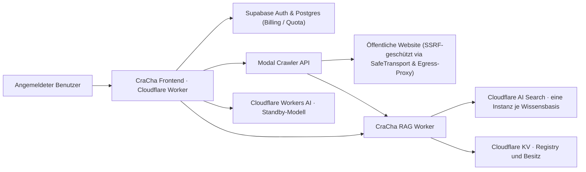

# Systemarchitektur

## Datenfluss

1. Das Frontend prüft und reserviert einen Wissensbasis-Slot atomar in Supabase PostgreSQL (`database_allocate`, serialisiert mit Row-Lock, max. 25 Slots) und legt die Metadaten mit der serverseitig ermittelten Supabase-User-ID in Cloudflare KV an.
2. Der authentifizierte Crawl-Endpunkt startet einen Modal-Job.
3. Crawl4AI folgt internen Links per BFS, respektiert `robots.txt`, entfernt typische Seitenelemente und erzeugt Markdown.
4. Alle HTTP-Verbindungen des Crawlers werden über `SSRFSafeNetworkBackend` abgewickelt (IP-Pinning auf Socket-Ebene, Ausschluss privater/Loopback-IPs, Verhinderung von DNS-Rebinding). Chromium-Browser-Crawls laufen über den lokalen `SafeEgressProxy`.
5. Modal synchronisiert Seiten in Batches mit der RAG-API. URLs werden zu stabilen Item-Keys; entfernte Seiten werden beim Abschluss gelöscht.
6. AI Search erzeugt überlappende Chunks und indiziert sie als Vektoren und Keywords.
7. Eine Chatfrage wird vor Retrieval und Abrechnung auf maximal 4.000 Zeichen validiert. Bei BYOK-Schlüsseln wird der Key clientseitig im Session-Storage gehalten und bei Logout/Kontowechsel gelöscht.
8. Die Chatfrage wird hybrid gesucht, per Reranker sortiert und als begrenzter Kontext an Workers AI oder den konfigurierten BYOK-Provider gesendet.
9. Die Antwort verwendet Quellenmarker `[n]`; das Frontend erhält zusätzlich Titel, URL, Snippet und Score.

## Festgelegte RAG-Konfiguration

| Stufe | Konfiguration |
|---|---|
| Chunking | 800 Tokens, `chunk_overlap: 15` |
| Embedding | `@cf/baai/bge-m3` |
| Retrieval | Vector + BM25/Keyword |
| Retrieval-Limit | Maximal 4.000 Zeichen Frageeingabe |
| Fusion | Reciprocal Rank Fusion |
| Reranking | `@cf/baai/bge-reranker-base` |
| Retrieval-Kandidaten | 8–20, abhängig von `top_k` |
| Generationskontext | höchstens `top_k` Chunks, maximal 2 je Quellseite |
| Standard-Antwortmodell | `@cf/meta/llama-3.3-70b-instruct-fp8-fast` |

Diese Werte sind Startwerte. Änderungen werden anhand eines projektspezifischen Eval-Sets vorgenommen, nicht allein nach subjektivem Eindruck.

## Vertrauens- und Sicherheitsgrenzen

- **Frontend & RAG-API:** Supabase authentifiziert den Browser-Endnutzer am Frontend. Die RAG-API prüft den Aufrufer über ein gemeinsames Service-Secret (`CRACHA_SERVICE_TOKEN` / `QUERY_SECRET` / `INGEST_SECRET`) und vertraut der im Request übermittelten `user_id`. Es findet keine Supabase-JWT-Prüfung im RAG-Worker statt.
- **Besitz und Quota:** KV-Besitz wird vor Suche, Crawl, Änderung und Löschung geprüft. Die maximale Anzahl von 25 Wissensbasen je Konto wird atomar in PostgreSQL über `database_allocate` durchgesetzt. Parallele Erstellungsanfragen werden durch transaktionsweite Advisory-Locks (`pg_advisory_xact_lock`) pro Benutzer sowie Row-Locks auf `credit_accounts` serialisiert.
- **Crawl-Lebenszyklus:** Eine Wissensbasis kann während eines aktiven Crawls oder vor Abschluss der Credit-Abrechnung nicht gelöscht werden (HTTP 409 Conflict).
- **SSRF-Schutz:**
  - HTTP-Anfragen: `SSRFSafeNetworkBackend` löst Hostnamen auf, validiert die IP-Adresse (Sperre von Loopback, Link-Local, RFC 1918, Multicast) und verbindet den TCP-Socket direkt mit der geprüften IP. SNI und Zertifikatsvalidierung bleiben für HTTPS unverändert. Ein DNS-Rebinding zwischen Validierung und Connect ist netzwerkseitig ausgeschlossen.
  - Browser-Crawls: Chromium wird über einen lokalen Forwarding-Proxy (`SafeEgressProxy`) geleitet, der HTTP- und CONNECT-Ziele vor dem Verbindungsaufbau filtert.
- **BYOK-Sicherheit:** Benutzereigene API-Keys werden ausschließlich im flüchtigen Arbeitsspeicher (React/Zustand In-Memory-State) gehalten, niemals in Storage-APIs (weder localStorage noch sessionStorage) abgelegt, bei Logout oder Kontowechsel gelöscht und fließen niemals in den persistenten Server-Speicher. Ohne gültigen Key ist keine freie Modellwahl möglich.
- **Webinhalte:** Webinhalt ist im Generationsprompt ausdrücklich nicht vertrauenswürdig; darin enthaltene Systemanweisungen oder Jailbreaks werden ignoriert.

## Bewusste MVP-Grenzen

- Kein Login-Crawling und keine privaten Intranets.
- Kein inkrementelles DOM-Diffing; URL-stabile Upserts vermeiden dennoch Duplikate.
- Dynamisch gerenderte und stark geschützte Seiten können trotz Browser-Crawl unvollständig bleiben.
