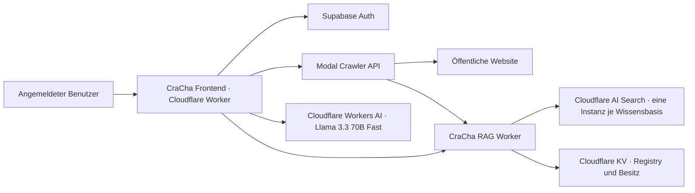

# Systemarchitektur

## Datenfluss

1. Das Frontend legt eine Wissensbasis mit serverseitig ermittelter Supabase-User-ID in KV an.
2. Der authentifizierte Crawl-Endpunkt startet einen Modal-Job.
3. Crawl4AI folgt internen Links per BFS, respektiert `robots.txt`, entfernt typische Seitenelemente und erzeugt Markdown.
4. Modal synchronisiert Seiten in Batches mit der RAG-API. URLs werden zu stabilen Item-Keys; entfernte Seiten werden beim Abschluss gelöscht.
5. AI Search erzeugt überlappende Chunks und indiziert sie als Vektoren und Keywords.
6. Eine Chatfrage wird hybrid gesucht, per Reranker sortiert und als begrenzter Kontext an Workers AI gesendet.
7. Die Antwort verwendet Quellenmarker `[n]`; das Frontend erhält zusätzlich Titel, URL, Snippet und Score.

## Festgelegte RAG-Konfiguration

| Stufe | Konfiguration |
|---|---|
| Chunking | 800 Tokens, `chunk_overlap: 15` |
| Embedding | `@cf/baai/bge-m3` |
| Retrieval | Vector + BM25/Keyword |
| Fusion | Reciprocal Rank Fusion |
| Reranking | `@cf/baai/bge-reranker-base` |
| Retrieval-Kandidaten | 8–20, abhängig von `top_k` |
| Generationskontext | höchstens `top_k` Chunks, maximal 2 je Quellseite |
| Antwortmodell | `@cf/meta/llama-3.3-70b-instruct-fp8-fast` |

Diese Werte sind Startwerte. Änderungen werden anhand eines projektspezifischen Eval-Sets vorgenommen, nicht allein nach subjektivem Eindruck.

## Sicherheitsgrenzen

- Supabase authentifiziert Browserzugriffe; die RAG-API prüft den Access Token erneut.
- KV-Besitz wird vor Suche, Crawl, Änderung und Löschung geprüft.
- Modal-API und Ingest-API verwenden getrennte Bearer-Secrets.
- Der Crawler blockiert nicht öffentliche IP-Ziele und eingebettete URL-Credentials.
- Webinhalt ist im Generationsprompt ausdrücklich nicht vertrauenswürdig; darin enthaltene Anweisungen werden nicht befolgt.

## Bewusste MVP-Grenzen

- Kein Login-Crawling und keine privaten Intranets.
- Kein inkrementelles DOM-Diffing; URL-stabile Upserts vermeiden dennoch Duplikate.
- Dynamisch gerenderte und stark geschützte Seiten können trotz Browser-Crawl unvollständig bleiben.
